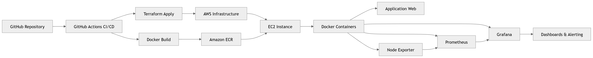
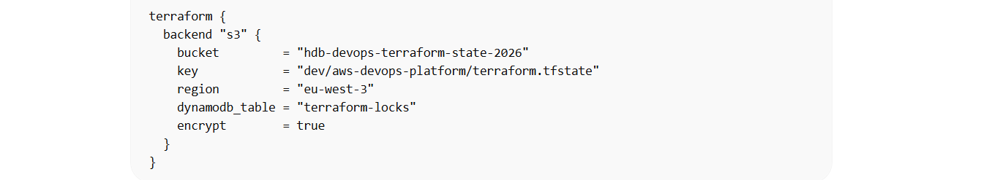
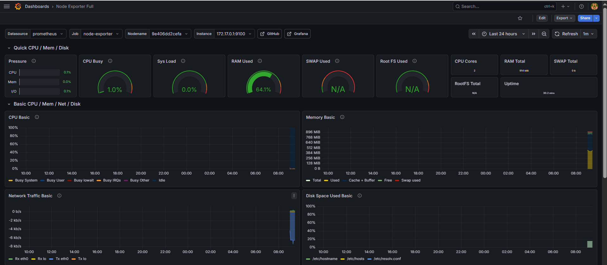

## 🚀 AWS DevOps Platform with Terraform, Docker, CI/CD and Monitoring

Projet DevOps démontrant le déploiement automatisé d'une application conteneurisée sur AWS, en s'appuyant sur Terraform, Docker, GitHub Actions et Amazon ECR, avec supervision complète.

---

## 🎯 Objectif du projet

Ce projet a pour but de mettre en place une chaîne DevOps complète :

- Provisionnement d'une infrastructure AWS avec Terraform
- Conteneurisation d'une application avec Docker
- Mise en place d’un pipeline CI/CD avec GitHub Actions
- Déploiement automatisé via Amazon ECR et EC2
- Supervision avec Prometheus et Grafana

---

## 🛠️ Technologies utilisées

- **AWS (EC2, IAM, ECR, S3, DynamoDB)**
- **Terraform (Infrastructure as Code)**
- **Docker**
- **GitHub Actions (CI/CD)**
- **Prometheus**
- **Grafana**

---

## 🏗️ Architecture

GitHub → GitHub Actions → Amazon ECR → EC2 → Docker → Prometheus → Grafana

## Architecture détaillée

## Description de l'architecture

- Le code est versionné sur GitHub
- GitHub Actions construit l'image Docker et la pousse vers Amazon ECR
- Terraform provisionne l'infrastructure AWS (EC2, réseau, sécurité)
- L'instance EC2 exécute les conteneurs Docker
- Prometheus collecte les métriques via node-exporter
- Grafana permet la visualisation et l'alerting

##### Le projet utilise un backend Terraform distant basé sur Amazon S3 pour le stockage du state et DynamoDB pour le verrouillage.

Avantages :
- Stockage sécurisé et centralisé du state
- Verrouillage des déploiements pour éviter les conflits
- Compatible avec les workflows CI/CD

## Prérequis

Avant de commencer, assurez-vous d'avoir installé :

- Terraform
- Docker
- Git
- un compte AWS
- une paire de clés SSH pour se connecter à l'instance EC2

## Étape 1 : Cloner le projet

- git clone https://github.com/hermann85/aws-devops-platform.git
- cd aws-devops-terraform-docker-cicd-monitoring

## Étape 2 : Déployer l'infrastructure AWS

- cd terraform
- terraform init
- terraform plan
- terraform apply

## Étape 3 : Se connecter à l'instance EC2

- ssh -i .\aws-devops-platform.pem ec2-user@IP_INSTANCE 

- Remplacez IP_INSTANCE par l'adresse IP publique de votre instance EC2.

## Étape 4 : Lancer l'application

- cd app :
- docker build -t web .
- docker run -d -p 80:80 web

## Étape 5 : Monitoring

- Mise en place de Prometheus pour collecter les métriques
- Utilisation de node-exporter pour superviser l’instance EC2
- Configuration de Grafana pour la visualisation des métriques
- Création de dashboards personnalisés (CPU, mémoire, réseau)

## Étape 6 : CI/CD

Créer les secrets GitHub :

- EC2_HOST
- EC2_SSH_KEY
- EC2_USER
- AWS_ACCESS_KEY_ID
- AWS_SECRET_ACCESS_KEY
- AWS_ACCOUNT_ID

Chaque push sur main déclenche le déploiement automatique.

## Stratégie de branches

Le projet suit une stratégie de gestion des branches adaptée à un workflow DevOps :

- development : environnement de développement et d’intégration
- staging : environnement de préproduction pour validation
- main : environnement de production

Workflow : development → staging → main

- Les nouvelles fonctionnalités sont développées sur development
- Les versions stables sont testées sur staging
- Les versions validées sont déployées en production via main

État actuel :

- Actuellement, seul l’environnement dev est déployé.
- Les environnements staging et prod constituent une évolution prévue du projet.

## Sécurité

- Utilisation de rôles IAM pour EC2
- Accès restreint via Security Groups
- Gestion des secrets avec GitHub Actions
- Mise en place d’un reverse proxy avec Nginx
- Génération de certificats SSL avec Let's Encrypt (Certbot)
- Accès sécurisé via HTTPS :
  - https://hdb-devops.fr
  - https://grafana.hdb-devops.fr
  - https://prometheus.hdb-devops.fr

## Compétences démontrées : 

- Infrastructure as Code (Terraform)
- CI/CD avec GitHub Actions
- Containerisation avec Docker
- Déploiement AWS (EC2 + ECR)
- Monitoring (Prometheus / Grafana)
- Gestion des permissions (IAM, Security Groups)
- Debug et troubleshooting cloud

## Améliorations possibles

- Alerting Grafana : SMPT à finir
- Déploiement multi-environnements (dev/staging/prod) : en cours
- Migration vers Kubernetes (EKS)
- Mise en place d’un load balancer

## Résultat :

À la fin du projet :

- Infrastructure AWS automatisée avec Terraform
- Backend Terraform sécurisé avec S3 + DynamoDB
- Application Docker déployée automatiquement via CI/CD
- Pipeline GitHub Actions fonctionnel avec ECR
- Monitoring en temps réel avec Prometheus et Grafana

Auteur : Hermann Bienvenu DZOUAVELE IKYA 
- Ingénieur Devops 